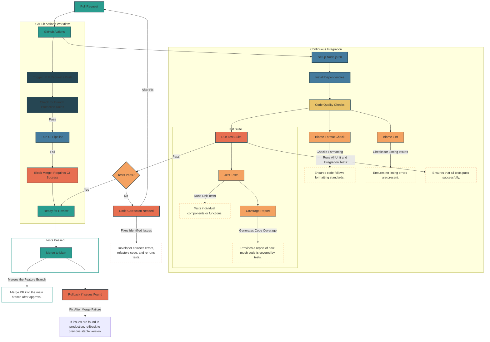

```mermaid
flowchart TD
    %% Pull Request Starts the Process
    PR[Pull Request] --> GHA[GitHub Actions]

    %% GitHub Actions Workflow
    subgraph "GitHub Actions Workflow"
        GHA --> Trigger[Trigger: Pull Request / Push]
        Trigger --> Check[Check for Branch Protection Rules]
        Check -->|Pass| CI[Run CI Pipeline]
        CI -->|Fail| Block[Block Merge: Requires CI Success]
        Block --> Review
    end

    %% Continuous Integration Subgraph
    subgraph "Continuous Integration"
        GHA --> Setup[Setup Node.js 20]
        Setup --> Install[Install Dependencies]
        Install --> Quality[Code Quality Checks]
        
        %% Code Quality Checks
        Quality --> Format[Biome Format Check]
        Format -->|Checks Formatting| FormatDesc["Ensures code follows formatting standards."]
        Quality --> Lint[Biome Lint]
        Lint -->|Checks for Linting Issues| LintDesc["Ensures no linting errors are present."]
        
        %% Running Tests
        Quality --> Tests[Run Test Suite]
        Tests -->|Runs All Unit and Integration Tests| TestDesc["Ensures that all tests pass successfully."]
        
        %% Test Suite Subgraph
        subgraph "Test Suite"
            Tests --> Jest[Jest Tests]
            Jest -->|Runs Unit Tests| JestDesc["Tests individual components or functions."]
            Jest --> Coverage[Coverage Report]
            Coverage -->|Generates Code Coverage| CoverageDesc["Provides a report of how much code is covered by tests."]
        end
    end

    %% Decision after Tests
    Tests -->|Pass| Decision{Tests Pass?}
    Decision -->|Yes| Review[Ready for Review]
    Decision -->|No| Fix[Code Correction Needed]

    %% Code Correction Needed Details
    Fix -->|After Fix| PR
    Fix -->|Fixes Identified Issues| FixDesc["Developer corrects errors, refactors code, and re-runs tests."]
    
    %% Review and Merge to Main
    Review --> Merge[Merge to Main]
    Merge -->|Merges the Feature Branch| MergeDesc["Merge PR into the main branch after approval."]
    
    %% Rollback Strategy
    Merge --> Rollback[Rollback if Issues Found]
    Rollback -->|Fix After Merge Failure| RollbackDesc["If issues are found in production, rollback to previous stable version."]

    %% Outline Box for "Tests Passed"
    subgraph PassedTests["Tests Passed"]
        style PassedTests fill:none,stroke:#2a9d8f,stroke-width:2px
        Review
        Merge
    end

    %% Styling for Visual Clarity
    style PR fill:#2a9d8f,stroke:#264653,stroke-width:2px
    style GHA fill:#2a9d8f,stroke:#264653,stroke-width:2px
    style Trigger fill:#264653,stroke:#264653,stroke-width:2px
    style Check fill:#264653,stroke:#264653,stroke-width:2px
    style CI fill:#457b9d,stroke:#264653,stroke-width:2px
    style Block fill:#e76f51,stroke:#264653,stroke-width:2px
    style Setup fill:#457b9d,stroke:#264653,stroke-width:2px
    style Install fill:#457b9d,stroke:#264653,stroke-width:2px
    style Quality fill:#e9c46a,stroke:#264653,stroke-width:2px
    style Format fill:#f4a261,stroke:#264653,stroke-width:1px
    style Lint fill:#f4a261,stroke:#264653,stroke-width:1px
    style Tests fill:#e76f51,stroke:#264653,stroke-width:2px
    style Jest fill:#f4a261,stroke:#264653,stroke-width:1px
    style Coverage fill:#f4a261,stroke:#264653,stroke-width:1px
    style Decision fill:#f4a261,stroke:#264653,stroke-width:2px,shape:diamond
    style Fix fill:#e76f51,stroke:#264653,stroke-width:2px
    style Review fill:#2a9d8f,stroke:#264653,stroke-width:2px
    style Merge fill:#2a9d8f,stroke:#264653,stroke-width:2px
    style Rollback fill:#e76f51,stroke:#264653,stroke-width:2px
    style FormatDesc fill:none,stroke:#f4a261,stroke-width:1px,stroke-dasharray: 5,5
    style LintDesc fill:none,stroke:#f4a261,stroke-width:1px,stroke-dasharray: 5,5
    style TestDesc fill:none,stroke:#e76f51,stroke-width:1px,stroke-dasharray: 5,5
    style JestDesc fill:none,stroke:#f4a261,stroke-width:1px,stroke-dasharray: 5,5
    style CoverageDesc fill:none,stroke:#f4a261,stroke-width:1px,stroke-dasharray: 5,5
    style FixDesc fill:none,stroke:#e76f51,stroke-width:1px,stroke-dasharray: 5,5
    style MergeDesc fill:none,stroke:#2a9d8f,stroke-width:1px,stro


```